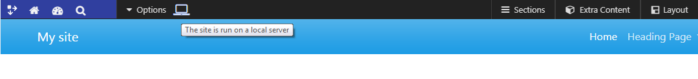
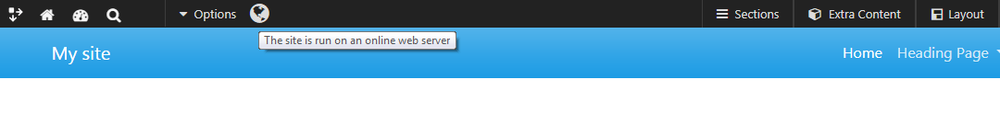

# [LocalServerAlert](https://github.com/mahotilo/LocalServerAlert) - Local Server Alert plugin for Typesetter CMS

## About
Change Admin Panel background color and add icon to alert that the site is run on a local server or on an online web server

## See also 
* [Typesetter Home](http://www.typesettercms.com)
* [Typesetter on GitHub](https://github.com/Typesetter/Typesetter)

## Requirements
* Typesetter CMS

## Manual Installation
1. Download the [master ZIP archive](https://github.com/mahotilo/LocalServerAlert/archive/master.zip)
2. Upload the extracted folder 'LocalServerAlert-master' to your server into the /addons directory
3. Install using Typesetter's Admin Toolbox &rarr; Plugins &rarr; Manage &rarr; Available &rarr; LocalServerAlert

## Demo
### Local web server

### Online web server

## License
GPL 2, for bundled thirdparty components see the respective subdirectories.

## Current Version 
1.2
	- checking also $_SERVER['REMOTE_ADDR'] to detect online server
